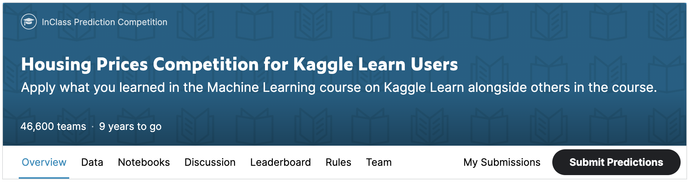

> **Источник материалов:** [Курс «Машинное обучение» на Kaggle Learn](https://www.kaggle.com/learn/intro-to-machine-learning)
> Все материалы для изучения взяты с данного сайта.

# Упражнение: Соревнования по машинному обучению

## Введение

В этом упражнении вы создадите и отправите предсказания для соревнования на Kaggle. Затем вы сможете улучшить свою модель (например, добавив признаки), чтобы применить полученные знания и подняться в таблице лидеров.

Начните с запуска ячейки кода ниже, чтобы настроить проверку кода и пути к файлам набора данных.

```python
# Настройка проверки кода
from learntools.core import binder
binder.bind(globals())
from learntools.machine_learning.ex7 import *

# Настройка путей к файлам
import os
if not os.path.exists("../input/train.csv"):
    os.symlink("../input/home-data-for-ml-course/train.csv", "../input/train.csv")  
    os.symlink("../input/home-data-for-ml-course/test.csv", "../input/test.csv") 
```

Вот часть кода, который вы уже написали. Начните с его повторного запуска.

```python
# Импорт полезных библиотек
import pandas as pd
from sklearn.ensemble import RandomForestRegressor
from sklearn.metrics import mean_absolute_error
from sklearn.model_selection import train_test_split

# Загрузка данных и выделение целевой переменной
iowa_file_path = '../input/train.csv'
home_data = pd.read_csv(iowa_file_path)
y = home_data.SalePrice

# Создание X (После завершения упражнения вы можете вернуться и изменить эту строку!)
features = ['LotArea', 'YearBuilt', '1stFlrSF', '2ndFlrSF', 'FullBath', 'BedroomAbvGr', 'TotRmsAbvGrd']

# Выбор столбцов, соответствующих признакам, и просмотр данных
X = home_data[features]
X.head()

# Разделение на валидационные и обучающие данные
train_X, val_X, train_y, val_y = train_test_split(X, y, random_state=1)

# Определение модели случайного леса
rf_model = RandomForestRegressor(random_state=1)
rf_model.fit(train_X, train_y)
rf_val_predictions = rf_model.predict(val_X)
rf_val_mae = mean_absolute_error(rf_val_predictions, val_y)

print("Валидационная MAE для модели случайного леса: {:,.0f}".format(rf_val_mae))
```

## Обучение модели для соревнования

Ячейка кода выше обучает модель случайного леса на `train_X` и `train_y`.

Используйте ячейку кода ниже, чтобы построить модель случайного леса и обучить её на всех данных `X` и `y`.

```python
# Для повышения точности создайте новую модель случайного леса, которую вы обучите на всех обучающих данных
rf_model_on_full_data = ____

# Обучите rf_model_on_full_data на всех данных из обучающего набора
____
```

Теперь прочитайте файл с тестовыми данными и примените вашу модель для создания предсказаний.

```python
# путь к файлу, который вы будете использовать для предсказаний
test_data_path = '../input/test.csv'

# чтение файла тестовых данных с помощью pandas
test_data = pd.read_csv(test_data_path)

# создание test_X, который берётся из test_data, но включает только те столбцы, которые вы использовали для предсказания.
# Список столбцов хранится в переменной features
test_X = ____

# создание предсказаний, которые мы будем отправлять.
test_preds = ____
```

Перед отправкой запустите проверку, чтобы убедиться, что `test_preds` имеет правильный формат.

```python
# Проверка вашего ответа (Чтобы получить зачёт за выполнение упражнения, вы должны получить результат "Correct"!)
step_1.check()
# step_1.solution()
```

## Формирование файла для отправки

Запустите ячейку кода ниже, чтобы сгенерировать CSV-файл с вашими предсказаниями, который вы сможете использовать для отправки в соревнование.

```python
# Запустите код для сохранения предсказаний в формате, используемом для оценки в соревновании

output = pd.DataFrame({'Id': test_data.Id,
                       'SalePrice': test_preds})
output.to_csv('submission.csv', index=False)
```

## Отправка в соревнование

Чтобы проверить свои результаты, вам нужно присоединиться к соревнованию (если вы ещё этого не сделали). Откройте новое окно, нажав на [эту ссылку](https://www.kaggle.com/c/home-data-for-ml-course). Затем нажмите кнопку **Join Competition**.



Далее следуйте инструкциям ниже:

1. Начните с нажатия кнопки **Save Version** в правом верхнем углу окна. Появится всплывающее окно.
2. Убедитесь, что выбран пункт **Save and Run All**, затем нажмите кнопку **Save**.
3. В левом нижнем углу ноутбука появится окно. После завершения выполнения нажмите на число справа от кнопки **Save Version**. Откроется список версий справа на экране. Нажмите на многоточие (**...**) справа от последней версии и выберите **Open in Viewer**. Вы перейдете в режим просмотра той же страницы. Прокрутите вниз, чтобы вернуться к этим инструкциям.
4. Нажмите на вкладку **Data** в верхней части экрана. Затем нажмите на файл, который вы хотите отправить, и нажмите кнопку **Submit**, чтобы отправить результаты в таблицу лидеров.

Поздравляю! Вы успешно отправили результаты в соревнование!

Если вы хотите продолжить работу над улучшением своих результатов, нажмите кнопку **Edit** в правом верхнем углу экрана. Затем вы сможете изменить свой код и повторить процесс. У вас есть много возможностей для улучшения, и вы будете подниматься в таблице лидеров по мере работы.

## Продолжение обучения

Есть много способов улучшить вашу модель, и экспериментирование — отличный способ учиться на данном этапе.

Лучший способ улучшить модель — добавить признаки. Чтобы добавить больше признаков в данные, вернитесь к первой ячейке кода и измените эту строку, включив в неё больше названий столбцов:

```python
features = ['LotArea', 'YearBuilt', '1stFlrSF', '2ndFlrSF', 'FullBath', 'BedroomAbvGr', 'TotRmsAbvGrd']
```

Некоторые признаки вызовут ошибки из-за таких проблем, как пропущенные значения или нечисловые типы данных. Вот полный список потенциальных столбцов, которые вы, возможно, захотите использовать и которые не вызовут ошибок:

- `MSSubClass`
- `LotArea`
- `OverallQual`
- `OverallCond`
- `YearBuilt`
- `YearRemodAdd`
- `1stFlrSF`
- `2ndFlrSF`
- `LowQualFinSF`
- `GrLivArea`
- `FullBath`
- `HalfBath`
- `BedroomAbvGr`
- `KitchenAbvGr`
- `TotRmsAbvGrd`
- `Fireplaces`
- `WoodDeckSF`
- `OpenPorchSF`
- `EnclosedPorch`
- `3SsnPorch`
- `ScreenPorch`
- `PoolArea`
- `MiscVal`
- `MoSold`
- `YrSold`

Посмотрите на список столбцов и подумайте, что может влиять на цены домов. Чтобы узнать больше о каждом из этих признаков, ознакомьтесь с описанием данных на странице соревнования.

После обновления ячейки кода выше, которая определяет признаки, повторно запустите все ячейки кода, чтобы оценить модель и сгенерировать новый файл для отправки.

## Что дальше?

Как упоминалось выше, некоторые признаки вызовут ошибку, если вы попытаетесь использовать их для обучения модели. Курс «Промежуточное машинное обучение» научит вас работать с такими типами признаков. Вы также узнаете, как использовать xgboost — метод, обеспечивающий ещё более высокую точность, чем случайный лес.

Курс по Pandas даст вам навыки обработки данных, чтобы быстро переходить от концептуальной идеи к реализации в ваших проектах по науке о данных.

Вы также готовы к курсу по глубокому обучению, где вы будете строить модели с производительностью выше человеческого уровня в задачах компьютерного зрения.